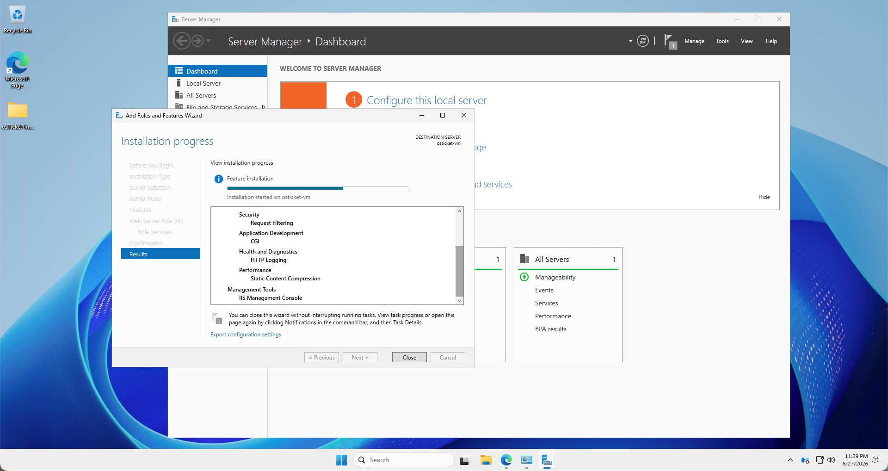
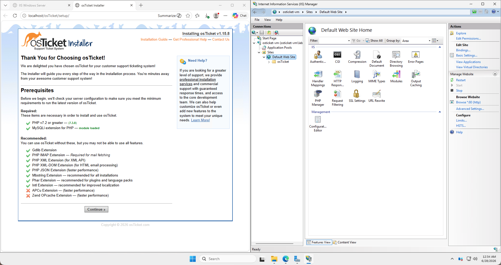
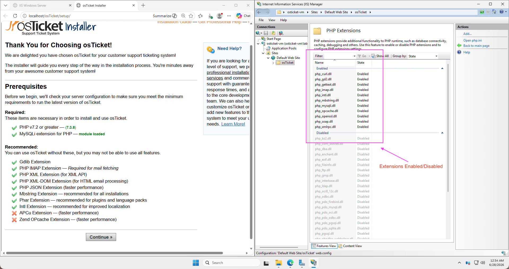

# osTicket: Prerequisites and Installation

This project demonstrates the deployment of **osTicket**, an open-source helpdesk ticketing system, within a virtualized Azure environment. This lab focuses on the infrastructure setup, web server configuration, and database integration required to host a functional helpdesk platform.

## Infrastructure Overview
*   **Virtualization:** Azure Virtual Machines
*   **Operating System:** Windows Server 2025 DataCenter
*   **Web Server:** IIS
*   **Database:** MySQLi
*   **PHP Version:** v7.3.8

## Deployment Steps
1.  **Environment Provisioning:** Configured and deployed a virtual machine in Azure.
2.  **Server Stack Installation:** Installed and configured the required web server, database management system, and PHP runtime environment.
3.  **Application Setup:** Downloaded, extracted, and placed the osTicket source files in the web root directory.
4.  **Database Configuration:** Created a dedicated database and user, granting the necessary privileges for osTicket.
5.  **Final Installation:** Completed the web-based installer and verified the application's functionality.

## Project Evidence

  
  
<b>Figure 1:</b> Configuration of Roles and Features in Windows Server 2025 DataCenter environment.

  
  
<b>Figure 1:</b> Successful installtion of osTicket prerequisites, Utilizing IIS manager.

  
  
<b>Figure 1:</b> Validation and inspection of PHP extensions configurations.

<!-- Image 2 -->

Figure 2: Verifying the web server and PHP environment settings required by osTicket.

## Lessons Learned
*   **Permission Management:** Learned how to correctly set file/folder permissions to ensure the web server could read/write necessary configuration files.
*   **Dependency Resolution:** Gained experience in troubleshooting missing PHP extensions required by osTicket during the pre-check phase.
*   **IIS Configuration:** Gained hands-on experience in managing server roles using Windows Server Manager.

---
*Created by Gerardo M.*
